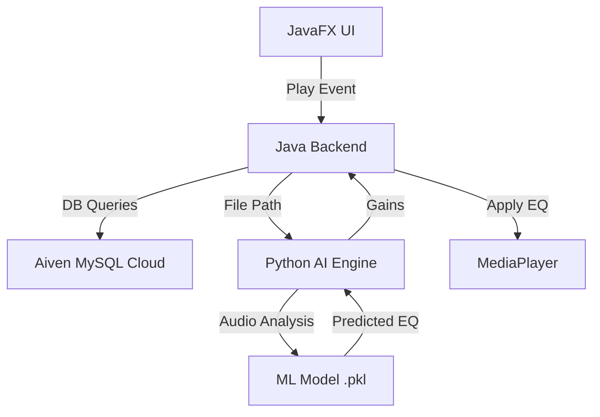

#  SoundNest: AI-Powered Adaptive Music Player

[](https://openjdk.org/projects/jdk/24/)
[](https://openjfx.io/)
[](https://www.python.org/)
[](https://aiven.io/)
[](LICENSE)
[]()

**SoundNest** is a next-generation desktop music player that marries high-fidelity audio playback with Artificial Intelligence. By leveraging machine learning models, SoundNest automatically optimizes equalizer settings in real-time, ensuring the best acoustic experience tailored to every unique track.

---

## 🚀 Project Overview

In the modern era of digital music, static equalizer settings often fail to capture the nuances of diverse genres. **SoundNest** solves this by implementing an **AI Auto-Equalizer** engine. Using a Python-based audio analysis backend, the system extracts spectral features (MFCCs, spectral centroids, energy) to predict and apply optimal 5-band EQ gains (Bass, Low Mid, Midrange, Presence, Treble).

### Real-World Context
This project demonstrates the integration of multi-language systems (Java & Python) and cloud-native databases (Aiven) to create a seamless, high-performance desktop application.

---

## ✨ Key Features

### 🧠 Core AI Engine
- **Predictive Equalization**: Automatically analyzes `.mp3` files upon playback to set the 5-band EQ.
- **Deep Audio Analysis**: Utilizes `librosa` for extracting advanced audio features.
- **Real-time Synchronization**: Java backend communicates with Python via high-speed subprocesses for instant feedback.

### 🎨 Premium UX/UI
- **Smooth RGB Animations**: A vibrant, color-shifting header using HSB-based interpolation.
- **Modern Dark Theme**: A sleek, Dracula-inspired palette for reduced eye strain and a premium feel.
- **Intuitive Library Management**: TreeView-based file explorer for local music discovery.

### ☁️ Cloud & Persistence
- **Aiven MySQL Integration**: All song metadata is synchronized with a high-availability cloud database.
- **Automated Migration**: Seamlessly migrates legacy local XAMPP databases to the cloud on first run.
- **Sync-Ready Library**: Access your song library metadata from any instance connected to the cloud db.

---

## 🛠 Technical Stack

| Component | Technology | Version |
| :--- | :--- | :--- |
| **Language (Core)** | Java (OpenJDK) | 24 |
| **UI Framework** | JavaFX | 24 |
| **AI Backend** | Python | 3.12 |
| **Audio Logic** | Librosa, LibAudio | Latest |
| **ML Libraries** | Scikit-learn, NumPy | Latest |
| **Persistence** | Aiven MySQL, JDBC | 8.0+ |

---

## 🏗 System Architecture

The application follows a modular architecture separating UI, Business Logic, and the AI Analysis layer.



### Module Breakdown
- **`MusicPlayerApp.java`**: Host application, UI management, and event handling.
- **`predict_eq.py`**: Python script handling audio feature extraction and model inference.
- **`Aiven DB`**: Central repository for song paths, titles, and artist data.

---

## 📦 Quick Start & Installation

### Prerequisites
1. **Java Development Kit (JDK) 24**: Ensure `JAVA_HOME` is set.
2. **Python 3.12**: Install required libraries:
   ```bash
   pip install librosa numpy joblib scikit-learn
   ```
3. **Database**: Create a free [Aiven MySQL](https://aiven.io/) instance.

### Installation Steps
1. **Clone the Repository**:
   ```bash
   git clone https://github.com/EzazAzhar/MusicPlayer-With-AI-AutoEqualizer.git
   cd MusicPlayer-With-AI-AutoEqualizer
   ```
2. **Configure Database**:
   Update the connection string and credentials in `MusicPlayerApp.java`:
   ```java
   String url = "jdbc:mysql://your-aiven-host:port/defaultdb";
   dbConnection = DriverManager.getConnection(url, "user", "password");
   ```
3. **Run the Application**:
   ```powershell
   ./run.ps1 # Or use your IDE's run command with JavaFX VM options
   ```

---

## 🖥 Usage Guide

1. **Add Music**: Click "Add Music Folder" to scan your local drive.
2. **Play & Analyze**: Double-click a song. Notice the "Predicting EQ..." status - the AI is working!
3. **Manual Override**: Want more bass? Head to the **Equalizer** tab and override the AI's suggestions.
4. **Cloud Sync**: Add a song on one machine; its metadata will appear on your other machines instantly.

---

## 📂 Project Structure

```text
SoundNest/
├── Project/
│   └── SoundNest/
│       ├── MusicPlayerApp.java    # Main Java Application
│       ├── pythonmodels/
│       │   ├── predict_eq.py      # AI Inference Script
│       │   └── eq_model.pkl       # Pre-trained ML Model
│       └── ...                    # Icons & Assets
├── .gitignore
├── MusicPlayerApp.jar             # Compiled Binary
└── README.md                      # Documentation
```

---

## 📈 Performance & Optimization
- **Parallel Processing**: AI analysis runs in a background thread to prevent UI freezing.
- **Connection Pooling**: Optimized MySQL queries for low-latency metadata retrieval.
- **Resource Management**: Automatical disposal of media resources to prevent memory leaks.

---

## 🤝 Contributing

Contributions are what make the open-source community an amazing place to learn, inspire, and create.
1. Fork the Project
2. Create your Feature Branch (`git checkout -b feature/AmazingFeature`)
3. Commit your Changes (`git commit -m 'Add some AmazingFeature'`)
4. Push to the Branch (`git push origin feature/AmazingFeature`)
5. Open a Pull Request

---

## 📜 License
Distributed under the MIT License. See `LICENSE` for more information.

---

## 📧 Contact
**Ezaz Azhar** - [GitHub](https://github.com/EzazAzhar) - [LinkedIn](https://linkedin.com/in/ezazazhar)
Project Link: [https://github.com/EzazAzhar/MusicPlayer-With-AI-AutoEqualizer](https://github.com/EzazAzhar/MusicPlayer-With-AI-AutoEqualizer)

---
<p align="center">Made with ❤️ for the Audio & AI Community</p>